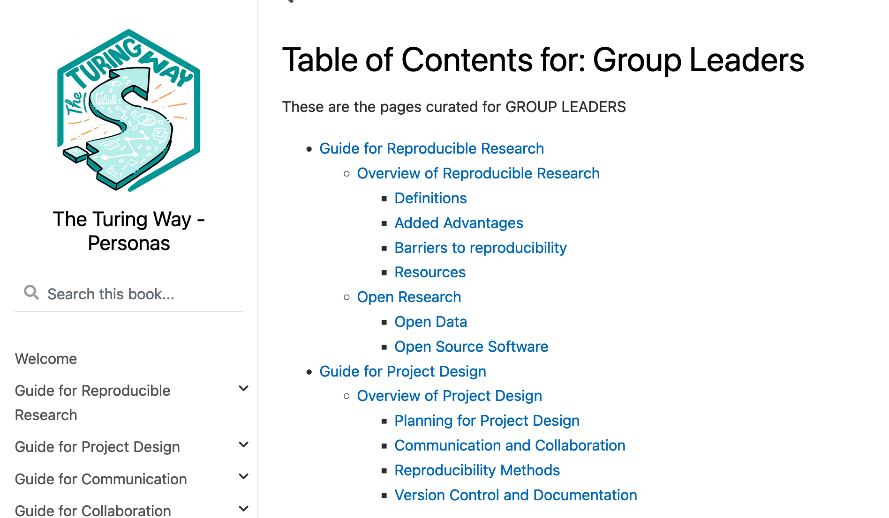

# User Guide for Turing Way Pathways

This package allows [*The Turing Way*](https://the-turing-way.netlify.app) to provide different entry points, referred to as Pathways.
Readers can use pathways to browse curated chapters based on their personas.

This documentation provide step by step guide for new users.

## Pathways Overview

The pathways panel is displayed on *The Turing Way's* Welcome Page.


Each pathway has a landing page with links to its pages across the Turing Way.



Each page has badges showing which pathways it belongs to.
The badges link back to the pathway's landing page.


## Managing a Pathways

In the [book's repository](https://github.com/the-turing-way/the-turing-way) the profiles file is located at `book/website/profiles.yml`
This YAML file defines which pages are included for different pathways.

Here is an example

```yaml
- name: Early Career Researchers
  files:
    - project-design/project-design
    - collaboration/github-novice
    - project-design/project-repo
...
  colour: blue
  description: Early Career Researchers (ECRs) are students, PhDs and early-stage
    postdocs who may not have a lot of experience in contributing to research
    projects from start to finish. This curated set of chapters will allow them
    to understand what best practices apply at different stages of development
    to ensure research reproducibility.
```

The pathways file is a list of pathways.
Each pathway has the following keys,

- **name**
  The pathway name.
  This will be used in the tags, the landing page title, and the card.
- **files**
  Relative paths of the pages to include (excluding `.md` suffix).
  Note that if you include a page without its parents it will not appear in the landing page.
  So it is not possible to have `communications/comms-overview/comms-overview-principles` without `communications/comms-overview/`.
  Pages missing from the landing page will still be tagged with badges.
- **colour**
  The colour of the pathway's badge.
  All CSS colour names should be supported.
- **description**
  Text describing the profile which the pathway was designed for.
  This text is displayed on the pathway's landing page.

## The Card Panel on the Welcome Page

The pathways script adds new (HTML) pages to the JupyterBook build.
A landing page for each of the pathways defined in `profiles.yml` is created.
A panel of pathways cards is also produced and added to the Welcome Page.

### Changing Where the Cards Appear

Currently, the cards are created under the heading Different Pathways.
The script `pathways/pathways/card.py` looks for the line of text `## Different Pathways` in the Welcome Page markdown file and inserts the card panels after it.

Alter both these files to change where the card panel appears on the Welcome Page, or change the heading name.
You will also need to update the test in `tests/test_card.py` for the tests to pass.

### Changing the Number of Pages per Card

Currently the first three pages for each pathway are shown on a card.
This is controlled by the variable `max_bullets` in the `create_bullet_string` function in `card.py`.

### Edit Cards' Appearance

Within `card.py`, edits can be made to change the appearance of the cards and panels in the `create_panel` function.
You can find the guidelines for this in the [Sphinx documentation](https://sphinx-panels.readthedocs.io/en/latest/#card-layout).

## Development Environment

To create a development environment with all dependencies and an editable install of the package run

```console
$ hatch create
```

You can enter a shell in this environment with

```console
$ hatch shell
```

## Building the Book with Pathways

With the pathways module in your Python path (for example, when in the hatch environment) run

```console
$ python -m pathways.main pathways <path to book/website/>
```
